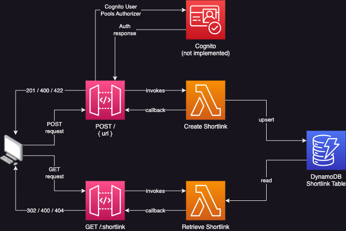

# URL Shortener

This project is a URL shortener that uses AWS CDK to deploy the infrastructure.

## Architecture



## Usage

### Create a short URL

Send a `POST` request to the endpoint URL `https://xb066xfo08.execute-api.us-west-2.amazonaws.com/prod`
The request body should contain a JSON object with a `url` property.

```json
{
    "url": "https://boards.greenhouse.io/battlefytechnologiesinc/jobs/4067109007"
}
```

Or you can run the following curl command in a terminal:
```bash
curl --request POST \
  --url https://xb066xfo08.execute-api.us-west-2.amazonaws.com/prod \
  --header 'Content-Type: application/json' \
  --data '{
	"url": "https://boards.greenhouse.io/battlefytechnologiesinc/jobs/4067109007"
}'
```
The response body will look something like:

```json
{
	"originalUrl": "https://boards.greenhouse.io/battlefytechnologiesinc/jobs/4067109007",
	"baseUrl": "https://xb066xfo08.execute-api.us-west-2.amazonaws.com/prod/",
	"code": "sVREV",
	"shortlink": "https://xb066xfo08.execute-api.us-west-2.amazonaws.com/prod/sVREV"
}
```

### Use a short URL

Copy and paste the `shortlink` value from the response body into your browser's address bar and hit enter.

https://xb066xfo08.execute-api.us-west-2.amazonaws.com/prod/sVREV

## Notes

* The five-character codes on the end of the shortened url are case sensitive.
* The api is totally unauthenticated as adding cognito users and authentication seemed out of scope for this project.
* If you try to create a shortlink for a url that has already been shortened, the api will return the existing shortlink.
* This is not hardened or bulletproof by any means. There is some basic data validation and error handling, but it is not exhaustive.
* The entries in dynamodb have a ttl of 30 days. This is to prevent the table from growing indefinitely.

## Questions and Answers

Answers to the questions in the project description.

### Guarantee handling of traffic bursts with over 9000 parallel requests?

* Lambda reserved or provisioned concurrency settings.
* Deploy to multiple regions and use cloudfront to route requests to lowest latency region.
* Insert an event handling service such as eventBridge or Kinesis in between the api gateway and the lambda functions.
* Api gateway caching to reduce latency of duplicate requests.

### Minimize monthly cloud provider costs as much as possible?

* Set TTL limits on the persisted data so that the dynamodb table does not grow indefinitely.
* Limit unnecessary logging in production, as at scale this can become costly.
* Move toward a more async approach with eventBridge or Kinesis to reduce the number of concurrent lambda invocations,
   staying away from provisioned concurrency.
* Api gateway response caching to reduce unnecessary lambda invocations and dynamo queries of duplicate requests.
* I'll bet there are some clever things you could do with dynamically generated dns alias records to reduce the number of lambda invocations.

### Protect the POST action so that only our administrators can submit URLs?

* Create a cognito user pool and an administrator group, add some users.
* Attach a congnitoUserPoolAuthorizer to the apiGateway method.
* Requests to POST would need to include a valid/active cognito session jwt to authorize, others would be rejected.
